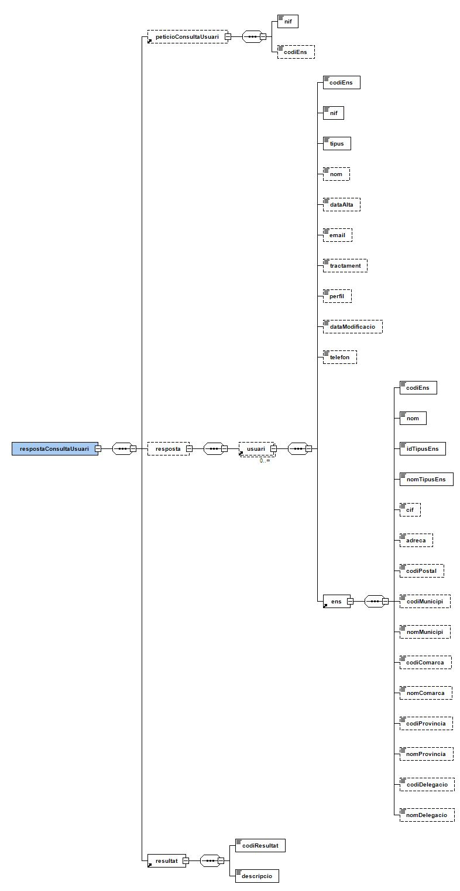

# EACAT - Modalitats de consum

Document d’integració del servei 


<b>Control del document</b>

<b>Informació general</b>

|Títol:         |Document d’integració del servei|
|----           | ----------              |
|Creat per:     |Departament de Projectes CAOC|
|A revisar per: |Departament de Projectes CAOC|
|A aprovar per: |Departament de Projectes CAOC|


<b>Històric de revisions</b>

|Versió|Data       |Autor          |Comentaris           |
|----  |----       |----           |----                 |
|V1.0	 |23/07/2015	|Projectes CAOC	|Creació del document |  
|V1.1	 |27/03/2018	|Projectes CAOC	|Actualització del document|
|V1.2	|20/04/2021	|Projectes CAOC	|Creació de la modalitat de conum funcionaris habilitats|


# Taula de continguts

- [1. Introducció](#1-introducció)
- [2. Transmissions de dades disponibles](#2-Transmissions-de-dades-disponibles)
- [3. Missatgeria del servei](#3-Missatgeria-del-servei)
   * [3.1. Dades d'usuaris (EACAT_USUARI)](#31-Dades-usuaris-EACAT_USUARI)
      - [3.1.1. Petició dades específiques](#311-Petició-dades-específiques)
      - [3.1.2. Resposta dades específiques](#312-Resposta-dades-específiques)   
          - [3.1.2.1. Resultat de l'operació](#3121-Resultat-de-la-operació)         
   * [3.2. Dades d'usuaris (EACAT_SERVEI)](#32-Dades-usuaris-EACAT_SERVEI)
      - [3.2.1. Petició dades específiques](#321-Petició-dades-específiques)
      - [3.2.2. Resposta dades específiques](#322-Resposta-dades-específiques)   
   * [3.3. Dades d'ens adherits  (EACAT_ENS)](#33-Dades-ens-adherits-EACAT_ENS)
      - [3.3.1. Petició dades específiques](#331-Petició-dades-específiques)
      - [3.3.2. Resposta dades específiques](#332-Resposta-dades-específiques)   
   * [3.4. Dades tipus d'ens adherits (EACAT_TIPUS_ENS)](#34-Dades-tipus-ens-adherits-EACAT_TIPUS_ENS)
      - [3.4.1. Petició dades específiques](#341-Petició-dades-específiques)
      - [3.4.2. Resposta dades específiques](#342-Resposta-dades-específiques)   
   * [3.5. Dades Funcionari Habilitat (EACAT_FUNCIONARI_HABILITAT)](#35-Dades-Funcionari-Habilitat-EACAT_FUNCIONARI_HABILITAT)
      - [3.5.1. Petició dades específiques](#351-Petició-dades-específiques)
      - [3.5.2. Resposta dades específiques](#352-Resposta-dades-específiques)


# 1. Introducció

Aquest document detalla la missatgeria associada al servei de consulta de dades d’EACAT.

Per poder realitzar la integració cal conèixer prèviament la següent documentació:

•	Document d’Especificació de missatgeria pel consum de productes de la plataforma PCI del Consorci AOC.


# 2. Transmissions de dades disponibles

Les dades i operacions disponibles a través del servei són les que es presenten a continuació:

|EMISSOR|
|----|
|Consorci Administració Oberta de Catalunya|

|PRODUCTE | MODALITAT                                                                                | DESCRIPCIO|
|----     | ----------                                                                               | ----------|
|EACAT     | [EACAT_USUARI](#31-Dades-usuaris-EACAT_USUARI)                                           | Consulta de dades d’usuaris enregistrats a l'EACAT.|
|EACAT     | [EACAT_SERVEI](#32-Dades-usuaris-EACAT_SERVEI)                                           | Consulta de dades de serveis enregistrats a l'EACAT.|
|EACAT     | [EACAT_ENS](#33-Dades-ens-adherits-EACAT_ENS)                                            | Consulta de dades d’ens adherits a l'EACAT.|
|EACAT     | [EACAT_TIPUS_ENS](#34-Dades-tipus-ens-adherits-EACAT_TIPUS_ENS)                          | Consulta de tipus d'ens a l'EACAT.|
|EACAT     | [EACAT_FUNCIONARI_HABILITAT](#35-Dades-Funcionari-Habilitat-EACAT_FUNCIONARI_HABILITAT)  | Consulta de funcionaris habilitats a l'EACAT.|


# 3. Missatgeria del servei

A continuació es detalla la missatgeria corresponent al bloc de dades específiques de les modalitats de consum del producte.


## 3.1. Dades usuaris EACAT_USUARI

### 3.1.1. Petició dades específiques

Aquesta modalitat permet consultar les dades dels usuaris enregistrats a l’EACAT.

<p align="center">

</p>


| Element | Descripció |
| --- | --- |
| /peticioConsultaUsuari/nif | NIF de l’usuari a consultar.  |
| /peticioConsultaUsuari/codiEns | Codi INE de l’ens al que pertany l’usuari. Si no s’informa, es retornen tots els ens de l’usuari indicat.  |


### 3.1.2. Resposta dades específiques

De l’schema associat a la resposta especifica, el servei informa les dades que es detallen a continuació.

<p align="center">

</p>


| Element | Descripció |
| --- | --- |
|/respostaConsultaUsuari/peticioConsultaUsuari|	Bloc de dades corresponent a la petició / criteris de cerca que origina la resposta. Per més detalls vegeu apartat anterior.|
|/respostaConsultaUsuari/resposta|	Bloc de dades corresponent a la resposta a la consulta.|
|/respostaConsultaUsuari/resposta/usuari|	Bloc de dades corresponent a les dades dels usuaris que compleixen els criteris de cerca.|
|//usuari/codiens|	Codi de l’ens.|
|//usuari/nif| NIF.|
|//usuari/tipus| Tipus d'usuari:<ul><li>MLO: usuari del món local</li><li>WIN: administrador del sistema</li><li>EPC: usuari d’EPOCA (la contrasenya de l’usuari es valida contra EPOCA)</li><li>CAC: usuari del servei del Consell Audiovisual de Catalunya</li><li>SNC: usuari de la Sindicatura de Comptes.</li></ul>|
|//usuari/nom|	Nom.|
|//usuari/dataAlta|	Data d’alta de l’usuari a l’EACAT.|
|//usuari/email|	Correu electrònic.|
|//usuari/tractament|	Tractament.|
|//usuari/perfil|	Perfil.|
|//usuari/dataModificacio|	Data de modificació.|
|//usuari/telèfon|	Telèfon.|
|//usuari/ens|	Bloc de dades corresponents a les dades de l’ens.|
|//usuari/ens/codiens|	Codi de l’ENS.|
|//usuari/ens/nom|	Nom de l’ens.|
|//usuari/ens/idTipusEns|	Codi del tipus ens.|
|//usuari/ens/nomTipusEns|	Nom del tipus ens.|
|//usuari/ens/cif|	CIF de l’ens.|
|//usuari/ens/adreca|	Adreça de l’ens.|
|//usuari/ens/codiPostal|	Codi postal de l’ens.|
|//usuari/ens/codiMunicipi|	Codi municipi de l’ens.|
|//usuari/ens/nomMunicipi|	Nom municipi de l’ens.|
|//usuari/ens/codiComarca|	Codi comarca de l’ens.|
|//usuari/ens/nomComarca|	Nom comarca de l’ens.|
|//usuari/ens/codiProvincia|	Codi província de l’ens.|
|//usuari/ens/nomProvincia|	Nom província de l’ens.|
|//usuari/ens/codiDelegacio|	Codi delegació de l’ens:<ul><li>1: Barcelona</li><li>2: Girona</li><li>3: Lleida</li><li>4: Tarragona</li><li>5: Terres de l’Ebre</li></ul>|
|//usuari/ens/nomDelegacio|	Nom delegació de l’ens.|
|/respostaConsultaUsuari/resultat/codiResultat|	Codi de resultat de l'operació de consulta [Resultat operació](#3121-Resultat-de-la-operació) .|
|/respostaConsultaUsuari/resultat/descripcio|	Descripció del resultat.|


#### 3.1.2.1 Resultat de la operació

•	0: Operació realitzada correctament.

•	1: Error realitzant la consulta.


## 3.2. Dades usuaris EACAT_SERVEI

### 3.2.1. Petició dades específiques

Aquesta modalitat permet consultar les dades dels serveis enregistrats a l’EACAT.

<p align="center">

</p>  


| Element | Descripció |
| --- | --- |
|/peticioConsultaServei/servei|	Codi del servei a consultar. | 
|/peticioConsultaServei/nif|	NIF de l’usuari a filtrar.  Si no s’informa, es retornen totes les dades del servei indicat.|
|/peticioConsultaServei/codiEns|	Codi INE de l’ens a filtrar. Si no s’informa, es retornen totes les dades del servei indicat.|


### 3.2.2. Resposta dades específiques

De l’schema associat a la resposta especifica, el servei informa les dades que es detallen a continuació.

<p align="center">

</p>  


| Element | Descripció |
| --- | --- |
|/respostaConsultaServei/peticioConsultaServei|	Bloc de dades corresponent a la petició / criteris de cerca que origina la resposta. Per més detalls vegeu apartat anterior.|
|/respostaConsultaServei/resposta|	Bloc de dades corresponent a la resposta a la consulta.|
|/respostaConsultaServei/resposta/servei|	Bloc de dades corresponent a les dades dels serveis que compleixen els criteris de cerca.|
|//servei/nif|	NIF de l’usuari.|
|//servei/nom|	Nom de l’usuari.|
|//servei/perfil|	Perfil de l’usuari.|
|//servei/codiEns|	Codi de l’ens|
|//servei/nomEns|	Nom de l’ens.|
|//servei/idTipusEns|	Codi del tipus ens.|
|//servei/nomTipusEns|	Nom del tipus ens.|
|//servei/servei|	Servei.|
|//servei/rol|	Rol.|
|//servei/descripcio|	Descripció.|
|/respostaConsultaServei/resultat/codiResultat|	Codi de resultat de l’operació de consulta [Resultat operació](#3121-Resultat-de-la-operació).|
|/respostaConsultaServei/resultat/descripcio|	Descripció del resultat.|


## 3.3. Dades ens adherits EACAT_ENS

### 3.3.1. Petició dades específiques

Aquesta modalitat permet consultar les dades dels ens adherits a l’EACAT.

Com a mínim s’ha d’escollir un paràmetre d’entrada.

<p align="center">

</p>


| Element | Descripció |
| --- | --- |
|/peticioConsultaEns/codiEns|	Codi INE de l’ens a consultar. |
|/peticioConsultaEns/idTipusEns|	Codi tipus de l’ens a consultar. |
|/peticioConsultaEns/nom|	Nom de l’ens a consultar. |
|/peticioConsultaEns/nomMunicipi|	Nom del municipi de l’ens a consultar. |
|/peticioConsultaEns/nomProvincia|	Nom de la provincia de l’ens a consultar. |


### 3.3.2. Resposta dades específiques

De l’schema associat a la resposta especifica, el servei informa les dades que es detallen a continuació.
La resposta màxim serà de 500 blocs (/respostaConsultaEns/resposta/ens). Si voleu per exemple obtindré tots els Ajuntaments, podeu realitzar 4 crides (una per cada provincia).

```/peticioConsultaEns/idTipusEns``` --> 2

```/peticioConsultaEns/nomProvincia``` --> Barcelona | Lleida | Tarragona | Girona


<p align="center">

</p>


| Element | Descripció |
| --- | --- |
|/respostaConsultaEns/peticioConsultaEns|	Bloc de dades corresponent a la petició / criteris de cerca que origina la resposta. Per més detalls vegeu apartat anterior.|
|/respostaConsultaEns/resposta|	Bloc de dades corresponent a la resposta a la consulta.|
|/respostaConsultaEns/resposta/ens|	Bloc de dades corresponent a les dades dels ens que compleixen els criteris de cerca.|
|//ens/codiens|	Codi de L’ENS.|
|//ens/nom|	Nom.|
|//ens/idTipusEns|	Codi del tipus ens.|
|//ens/nomTipusEns|	Nom del tipus ens.|
|//ens/cif|	CIF.|
|//ens/adreca|	Adreça.|
|//ens/codiPostal|	Codi postal.|
|//ens/codiMunicipi|	Codi municipi.|
|//ens/nomMunicipi|	Nom municipi.|
|//ens/codiComarca|	Codi comarca.|
|//ens/nomComarca|	Nom comarca.|
|//ens/codiProvincia|	Codi província.|
|//ens/nomProvincia|	Nom província.|
|//ens/codiDelegacio|	Codi delegació:<ul><li>1: Barcelona</li><li>2: Girona</li><li>3: Lleida</li><li>4: Tarragona</li><li>5: Terres de l’Ebre</li><li>6: Catalunya Central</li><li>7: Alt Pirineu i Aran</li></ul>|
|//ens/nomDelegacio|	Nom delegació.|
|/respostaConsultaEns/resultat/codiResultat|	Codi de resultat de l’operació de consulta [Resultat operació](#3121-Resultat-de-la-operació).|
|/respostaConsultaEns/resultat/descripcio|	Descripció del resultat.|


## 3.4. Dades tipus ens adherits EACAT_TIPUS_ENS

### 3.4.1. Petició dades específiques

<p align="center">

</p>

### 3.4.2. Resposta dades específiques

<p align="center">

</p>


| Element | Descripció |
| --- | --- |
|/respostaConsultaTipusEns/peticioConsultaTipusEns|	Bloc de dades corresponent a la petició / criteris de cerca que origina la resposta. Per més detalls vegeu apartat anterior.|
|/respostaConsultaTipusEns/resposta|	Bloc de dades corresponent a la resposta a la consulta.|
|/respostaConsultaTipusEns/resposta/tipusEns|	Bloc de dades corresponent a les dades dels tipus d’ens.|
|//ens/idTipusEns|	Codi del tipus ens.|
|//ens/nomTipusEns|	Nom del tipus ens.|
|/respostaConsultaTipusEns/resultat/codiResultat|	Codi de resultat de l’operació de consulta [Resultat operació](#3121-Resultat-de-la-operació).|
|/respostaConsultaTipusEns/resultat/descripcio|	Descripció del resultat.|


## 3.5. Dades Funcionari Habilitat EACAT_FUNCIONARI_HABILITAT

### 3.5.1. Petició dades específiques

<p align="center">

</p>


| Element | Descripció |
| --- | --- |
|/peticioConsultaFuncionariHabilitat/codiEns|	Codi de l’ens|
|/peticioConsultaFuncionariHabilitat/nif|	Nif d’un usuari|
|/peticioConsultaFuncionariHabilitat/dataAltaInici|	Data inicial per agafar tots els usuaris desde aquesta data fins la data d’avui, es pot combinar amb dataAltaFi per indicar un rang de data mes curt. Exemple: 2020-09-29+01:00|
|/peticioConsultaFuncionariHabilitat/dataAltaFi|	Data fi per agafar tots els usuaris que s’hagin donat d’alta una data igual o inferior a la data informada, es pot combinar amb dataAltaFi per indicar un rang de data mes curt. Exemple: 2020-11-30+01:00|
|/peticioConsultaFuncionariHabilitat/assistirInteressats|	Boolean: Actiu/No actiu rol Assistència als interessats|
|/peticioConsultaFuncionariHabilitat/expCopiesAutentiques|	Boolean: Actiu/No actiu rol Expedició còpies autèntiques|
|/peticioConsultaFuncionariHabilitat/donatsBaixa|	Boolean: Sí s’envia un true també es mostraran els usuaris que s’han donat de baixa.|


### 3.5.2. Resposta dades específiques

<p align="center">

</p>


| Element | Descripció |
| --- | --- |
|/respostaConsultaEns/peticioConsultaFuncionariHabilitat|	Bloc de dades corresponent a la petició / criteris de cerca que origina la resposta. Per més detalls vegeu apartat anterior.|
|/respostaConsultaEns/funcionariHabilitat|	Bloc de dades corresponent a les dades dels Funcionaris Habilitats que compleixen els criteris de cerca.|
|//funcionariHabilitat/nom|	Nom de l’usuari.|
|//funcionariHabilitat/nif|	NIF de l’usuari|
|//funcionariHabilitat/tipus|	Tipus d’usuari:<ul><li>MLO: usuari del món local</li><li>WIN: administrador del sistema</li><li>EPC: usuari d’EPOCA (la contrasenya de l’usuari es valida contra EPOCA)</li><li>CAC: usuari del servei del Consell Audiovisual de Catalunya</li><li>SNC: usuari de la Sindicatura de Comptes.</ul>|
|//funcionariHabilitat/nomEns|	Nom de l’ens.|
|//funcionariHabilitat/codiEns|	Codi de l’ENS.|
|//funcionariHabilitat/dataAlta|	Quan es va donar d’alta el usuari a aquest rol.|
|//funcionariHabilitat/dataBaixa|	S’informa si s’ha donat de baixa aquest usuari al rol Funcionari Habilitat.|
|//funcionariHabilitat/assistirInteressats|	Rol Assistència als interessats|
|//funcionariHabilitat/expCopiesAutentiques|	Rol Expedició còpies autèntiques|
|//funcionariHabilitat/unitatAdministrativa|	Unitat administrativa.|
|/respostaConsultaEns/resultat/codiResultat|	Codi de resultat de l’operació de consulta [Resultat operació](#3121-Resultat-de-la-operació).|
|/respostaConsultaEns/resultat/descripcio|	Descripció del resultat.|
